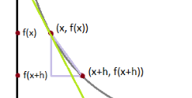

## Data Science from Scratch


by Joel Grus
Copyright © 2015 O’Reilly Media. All rights reserved.

------

Data Science

Data Scientist has been called The Sexiest Job of the 21st Century. According to a Venn diagram that is somewhat famous in the industry, data science lies at the intersection of:
• Hacking skills
• Math and statistics knowledge
• Substantive expertise

If you become a data scientist, you will become intimately familiar with NumPy, with scikit-learn, with pandas, and with a panoply of other libraries without actually understanding data science.

Joel, in this book, approached data science from scratch and tried to implement algorithms by hand in order to better understand them.

### Chapter 1

data scientists are statisticians, mathematicians, PhDs, engineers, etc ... Well, let's say that a data scientist is
someone who extracts insights from messy data. Today’s world is full of people trying to turn data into insight.

> OkCupid asks its members to answer thousands of questions in order to find the most appropriate matches for them but it also analyzes to find out how likely someone is to sleep with you on the first date.
>
> Facebook asks its mambers to list their locations, ostensibly to make it easier to find and connect them. But it also analyzes to identify global migration patterns to target ads.
>
> Target tracks purchases and interactions, both online and in-store. And it uses the data to predictively model which of its customers are pregnant, to better market baby-related purchases to them.
>
> Obama 2012 re-election used data scientists to identifying voters who needed extra attention, which means that political campaigns of the future will become more and more data-driven, resulting in a never-ending arms race of data science and data collection.

Some warm up example, Finding Key Connectors in a list of user with friendships data, FOAF, Salaries and experience, and topics of interest.

### Chapter 2

Python introduction

  

### Chapter 3: Visualizing Data

```python
from matplotlib import pyplot as plt
years = [1950, 1960, 1970, 1980, 1990, 2000, 2010]
gdp = [300.2, 543.3, 1075.9, 2862.5, 5979.6, 10289.7, 14958.3]
# create a line chart, years on x-axis, gdp on y-axis
plt.plot(years, gdp, color='green', marker='o', linestyle='solid')
# add a title
plt.title("Nominal GDP")
# add a label to the y-axis
plt.ylabel("Billions of $")
plt.show()

# _/
```

- Bar Charts: A bar chart is a good choice when you want to show how some quantity varies among some discrete set of items.
- Line Charts: As we saw already, we can make line charts using plt.plot() . These are a good choice for showing trends
- Scatterplots: A scatterplot is the right choice for visualizing the relationship between two paired sets of data.

For Further Exploration

- seaborn is built on top of matplotlib.
- D3.js is a JavaScript library.
- Bokeh is a newer library that brings D3-style visualizations into Python.
- ggplot is a Python port of the popular R library ggplot2 for “publication quality” charts and graphics.

### Chapter 4: Linear Algebra

LA: branch of mathematics that deals with vector spaces.

**Vector**: objects that can be added together; can multiplied by scalars (i.e., numbers) to form new vectors; good way to represent numeric data;

```python
def vector_add(v, w): return [v_i + w_i for v_i, w_i in zip(v, w)]
def vector_subtract(v,(v, w): return [v_i - w_i for v_i, w_i in zip(v, w)]         
def vector_sum(vectors):
    result = vectors[0]
    for vector in vectors[1:]: # then loop over the others
    	result = vector_add(result, vector)
    return result
def vector_sum(vectors): return reduce(vector_add, vectors)
def scalar_multiply(c, v): return [c * v_i for v_i in v]
def vector_mean(vectors): return scalar_multiply(1/len(vectors), vector_sum(vectors))
def dot(v, w): return sum(v_i * w_i for v_i, w_i in zip(v, w))
def sum_of_squares(v): return dot(v, v)
def magnitude(v): return math.sqrt(sum_of_squares(v))
def squared_distance(v, w): return sum_of_squares(vector_subtract(v, w))
def distance(v, w): return math.sqrt(squared_distance(v, w))
def distance(v, w): return magnitude(vector_subtract(v, w))
```

**Matrices**: a two-dimensional collection of numbers; lists of lists; 

```python
A = [[1, 2, 3], [4, 5, 6]]

def shape(A): return len(A), len(A[0]) if A else 0
def get_row(A, i): return A[i]
def get_column(A, j): return [A_i[j] for A_i in A]
def make_matrix(num_rows, num_cols, entry_fn):
	return [ [entry_fn(i, j) for j in range(num_cols)] for i in range(num_rows)]
def is_diagonal(i, j): return 1 if i == j else 0
identity_matrix = make_matrix(5, 5, is_diagonal)
```

friendships can be represented a matrix of $n \times n$ person 

```python
friends_of_five = [i for i, is_friend in enumerate(friendships[5]) if is_friend]
```

### Chapter 5: Statistics

#### Describe data  

```python
num_friends = [100, 49, 41, 40, 25, ..]
friend_counts = Counter(num_friends)
xs = range(101)
ys = [friend_counts[x] for x in xs]
plt.bar(xs, ys).show()
# gives A histogram of friend counts
# historgram is still too difficult to underdtand large data
num_points = len(num_friends)
largest_value = max(num_friends)
smallest_value = min(num_friends)
sorted_values = sorted(num_friends)
smallest_value = sorted_values[0]
second_smallest_value = sorted_values[1]
second_largest_value = sorted_values[-2]

```

**Central Tendencies**

Notion of where data is centered

```python
#the mean is simply the point halfway between
def mean(x): return sum(x)/len(x)
mean(num_friends) # 7.333333

#the median is the middle-most value (if the number of data points is odd) or the average of the two middle-most values (if the number of data points is even).
def median(v):
   """finds the 'middle-most' value of v"""
   n = len(v)
   sorted_v = sorted(v)
   midpoint = n // 2
   if n % 2 == 1:
   	# if odd, return the middle value
   	return sorted_v[midpoint]
   else:
   	# if even, return the average of the middle values
   	lo = midpoint - 1
  		hi = midpoint
   	return (sorted_v[lo] + sorted_v[hi]) / 2
median(num_friends) # 6.0

#quantile is a generalization of the median 
def quantile(x, p):
   """returns the pth-percentile value in x"""
   p_index = int(p * len(x))
   return sorted(x)[p_index]
quantile(num_friends, 0.10) #1
quantile(num_friends, 0.25) #3
quantile(num_friends, 0.75) #9
quantile(num_friends, 0.90) #13

#mode is most-common value
def mode(x):
   """returns a list, might be more than one mode"""
   counts = Counter(x)
   max_count = max(counts.values())
   return [x_i for x_i, count in counts.iteritems() if count == max_count]
mode(num_friends) # 1 and 6
```

But the mean is the most frequently used .

**Dispersion**

Dispersion refers to measures of how spread out our data is.

```python
#"range" already means something in Python, so we'll use a different name
#rane is just the difference between the largest and smallest elements
#max and min are equal then range is zero;
def data_range(x): return max(x) - min(x)
data_range(num_friends) # 99

# translate x by subtracting its mean (so the result has mean 0)
def de_mean(x): x_bar = mean(x) return [x_i - x_bar for x_i in x]

# assumes x has at least two elements; deviations = de_mean(len(x))
def variance(x): return sum_of_squares(de_mean(len(x))) / (n - 1)
variance(num_friends) # 81.54

def standard_deviation(x): return math.sqrt(variance(x))
standard_deviation(num_friends) # 9.03
#Both the range and the standard deviation have the same outlier problem that we saw earlier for the mean.

#a robust alternative computes the interquartile_range as difference of 75 and 25
def interquartile_range(x): return quantile(x, 0.75) - quantile(x, 0.25)
interquartile_range(num_friends) # 6
```

#### Correlation

See relation between num_friends and daily_minutes;

Covariance, the paired analogue of variance.

Variance measures how a single variable deviates from its mean, covariance measures how two
variables vary in tandem from their means.

```python
def covariance(x, y):
   n = len(x)
   return dot(de_mean(x), de_mean(y)) / (n - 1)
covariance(num_friends, daily_minutes) # 22.43
```

a “large” positive covariance => x tends to be large when y is large and small when y is small

A “large” negative covariance => x tends to be small when y is large and vice versa

A covariance close to zero means that no such relationship exists

=> hard to interpret => correlation between -1 and 1 & has no unit;

```python
def correlation(x, y):
   stdev_x = standard_deviation(x)
   stdev_y = standard_deviation(y)
   if stdev_x > 0 and stdev_y > 0:
   	return covariance(x, y) / stdev_x / stdev_y
   else:
   	return 0
# if no variation, correlation is zero
correlation(num_friends, daily_minutes) # 0.25
```

#### Simpson’s Paradox

#### Some Other Correlational Caveats

#### Correlation and Causation

### Chapter 6: Probability

#### Dependence and Independence

Two events E and F are independent if the result of the second event is not affected by the result of the first event. Else, E and F are dependent if the result of the first event affects the outcome of the second event so that the probability is changed: P(E, F) = P(E)P(F)

[2 red games, 3 green games]
[independent: take 2 games + replace them; p(red, green) = 1/2x1/3]
[dependent: take 2 games + 1 is replace; p(red, green) = 1/2x1/2]

#### Conditional Probability

The probability of E “conditional on F” as P(E|F) = P(E,F)/P(F)

>  You should think of this as the probability that E happens, given that we know that F happens.

Rewrite this as: P(E,F) = P(E|F)P(F)

When E and F are independent, you can check that this gives:  P(E) = P(E|F)

> knowing F occurred gives us no additional information about whether E occurred.

> the event “no girls” has probability 1/4, the event “one girl, one boy” has probability 1/2, and the event “two girls” has probability 1/4.

#### Bayes’s Theorem

“reversing” conditional probabilities

Need to know the probability of some event E conditional on some other event F occurring. But we only have information about the probability of F conditional on E occurring: P(E|F) = P(E,F)/P(F) = P(F|E)P(E)/P(F)

P(F) = P(F, E)P(F, not E)

#### Random Variables

A random variable is a variable whose possible values have an associated probability distribution.

#### Continuous Distributions

A coin flip corresponds to a discrete distribution.

The uniform distribution puts equal weight on all the numbers between 0 and 1.

Continuous distribution is represented with a probability density function (pdf) where the probability of seeing a value in a certain interval equals the integral of the density function over the interval.

```python
def uniform_pdf(x): return 1 if x >= 0 and x < 1 else 0
```

Cumulative distribution function (cdf), which gives the probability that a random variable is less than or equal to a certain value.

```python
def uniform_cdf(x):
   if x < 0: return 0
   elif x < 1: return x
   else: return 1
```

#### The Normal Distribution

The king of distributions. Uses two parameters: its mean μ (mu) and its standard deviation σ (sigma). The mean indicates where the bell is centered, and the standard deviation how “wide” it is.

```python
def normal_pdf(x, mu=0, sigma=1):
	sqrt_two_pi = math.sqrt(2 * math.pi)
	return (math.exp(-(x-mu) ** 2 / 2 / sigma ** 2) / (sqrt_two_pi * sigma))
```

#### The Central Limit Theorem

One reason the normal distribution is so useful is the central limit theorem, which says (in essence) that a random variable defined as the average of a large number of independent and identically distributed random variables is itself approximately normally distributed.

### Chapter 7: Hypothesis and Inference

#### Statistical Hypothesis Testing

Setup hypotheses for statistics: null hypothesis H0 as default position; Create H1.. Hn and try to accept/reject. Use probability to conclude.

#### Confidence Intervals

Test hypotheses about the value of the probability p so construct a confidence interval around the observed value of the parameter.

#### P-hacking

Determine hypotheses before looking at the data; Clean data without the hypotheses in mind; Keep in mind that p-values are not substitutes for common sense.

> P-hacking is the practice of performing a large number of analyses in a dataset with the intention of finding a p-value lower than 0.05. Then, the investigator publishes the “significant” result and never mentions all the other analysis.

```python
def run_experiment():
    """flip a fair coin 1000 times, True = heads, False = tails"""
	return [random.random() < 0.05 for _ in range(1000)]

def reject(experiment):
    """using the 5% significance levels"""
    num_heads = len([flip for flip in experiment if flip])    
    return num_heads < 469 or num_heads > 531

experiments = [run_experiment() for _ in range(1000)]
num_rejections = len([experiment for experiment in experiments if reject(experiment)])
print (num_rejections) # 46
```

What this means is that if you’re setting out to find “significant” results, you usually can. Test enough hypotheses against your data set, and one of them will almost certainly appear significant. Remove the right outliers, and you can probably get your p value below 0.05.

#### Example: Running an A/B Test

Test 2 ads with 2 groups like or no;

```python
# N number of persons
# n number of responses; n <= N
def estimated_parameters(N, n):
    p = n / N
    sigma = math.sqrt(p * (1 - p) / N)
    return p, sigma

def a_b_test_statistic(N_A, n_A, N_B, n_B):
    p_A, sigma_A = estimated_parameters(N_A, n_A)
    p_B, sigma_B = estimated_parameters(N_B, n_B)
    return (p_B - p_A) / math.sqrt(sigma_A ** 2 + sigma_B ** 2)
```

#### Bayesian Inference

//

### Chapter 8: Gradient descent

“A gradient measures how much the output of a function changes if you change the inputs a little bit.” — Lex Fridman (MIT).

Used to find the values of a functions parameters (coefficients) that minimize a cost function as far as possible.

#### The idea

Suppose a function f that takes a list of values and return a single value. So we'll need to  maximize or minimize f => find the input v that produces the largest (or smallest) possible value.

The gradient gives the input direction in which the function most quickly increases.

The approach to maximizing a function is to pick a random starting point, compute the gradient, take a small step in the direction of the gradient (i.e., the direction that causes the function to increase the most), and repeat with the new starting point. Similarly, you can try to minimize a function by taking small steps in
the opposite direction.

#### Estimating the Gradient

As f(x), the derivative at a point x measures how f(x) changes when we make a very small change to x . It is defined as the limit of the difference quotients as h approaches zero.

```python
def difference_quotient(f, x, h): return (f(x + h) - f(x)) / h
```

The derivative is the slope of the tangent line at (x, f(x)) , 

the difference quotient is the slope of the not-quite-tangent line that runs through x + h, f x + h . As h gets smaller and smaller, the not-quite-tangent line gets closer and closer to the tangent line



```python
def partial_difference_quotient(f, v, i, h):
    """compute the ith partial difference quotient of f at v"""
    w = [v_j + (h if j == i else 0)
    # add h to just the ith element of v
    for j, v_j in enumerate(v)]
    	return (f(w) - f(v)) / h
    
def estimate_gradient(f, v, h=0.00001):
    return [partial_difference_quotient(f, v, i, h)
    	for i, _ in enumerate(v)]
```

#### Using the Gradient

Find min of `sum_of_squares` using GD. 

```python
"""computes the sum of squared elements in v"""
def sum_of_squares(v): return sum(v_i ** 2 for v_i in v)	
```

And

```python
def step(v, direction, step_size):
    """move step_size in the direction from v"""
    return [v_i + step_size * direction_i for v_i, direction_i in zip(v, direction)]

def sum_of_squares_gradient(v):  return [2 * v_i for v_i in v]
    
# pick a random starting point
v = [random.randint(-10,10) for i in range(3)]
tolerance = 0.0000001

while True:
    gradient = sum_of_squares_gradient(v) # compute the gradient at v
    next_v = step(v, gradient, -0.01)     # take a negative gradient step
    if distance(next_v, v) < tolerance:   # stop if we're converging
    	break
    v = next_v
```

```
...
v =  [3.1378647403519605e-06, -2.7892131025350726e-06, -2.7892131025350726e-06] next_v =  [3.075107445544921e-06, -2.733428840484371e-06, -2.733428840484371e-06] d =  1.0080796514452779e-07 tolerance 1e-07 d < t =  False

v =  [3.075107445544921e-06, -2.733428840484371e-06, -2.733428840484371e-06] next_v =  [3.0136052966340228e-06, -2.678760263674684e-06, -2.678760263674684e-06] d =  9.879180584163681e-08 tolerance 1e-07 d < t =  True
```

#### Choosing the Right Step Size

`step_sizes = [100, 10, 1, 0.1, 0.01, 0.001, 0.0001, 0.00001]`

step_sizes is last parameter in step function.

```python
def minimize_batch(target_fn, gradient_fn, theta_0, tolerance=0.000001):
    """use gradient descent to find theta that minimizes target function"""
    
    step_sizes = [100, 10, 1, 0.1, 0.01, 0.001, 0.0001, 0.00001] 
    
    theta = theta_0                         # set theta to initial value
    target_fn = safe(target_fn)             # safe version of target_fn 
    value = target_fn(theta)                # value we're minimizing
    while True: 
        gradient = gradient_fn(theta)
        next_thetas = [step(theta, gradient, -step_size) for step_size in step_sizes]
        
    # choose the one that minimizes the error function
    next_theta = min(next_thetas, key=target_fn)
    next_value = target_fn(next_theta)
    # stop if we're "converging"
    if abs(value - next_value) < tolerance:
    	return theta
    else:
    	theta, value = next_theta, next_value
```

#### Stochastic Gradient Descent

Stochastic gradient descent, which computes the gradient (and takes a step) for only one point at a time.
It cycles over our data repeatedly until it reaches a stopping point.

Using the previous batch approach, each gradient step requires us to make a prediction and compute the
gradient for the whole data set, which makes each step take a long time.

### Chapter 9: Getting data

Data: most of passed time is about acquiring, cleaning, and transforming data.

